# VistaControls

<p align="center">
  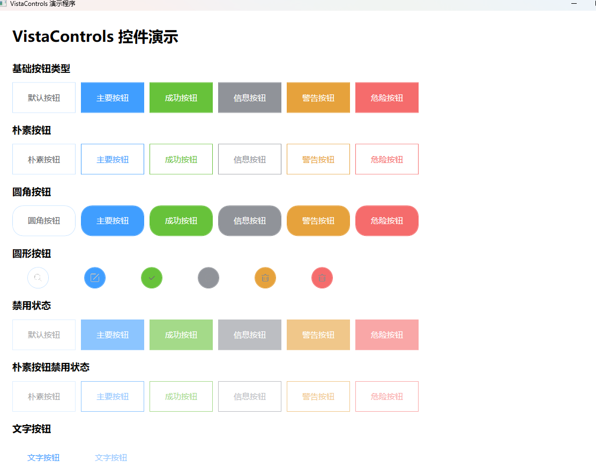
</p>

<p align="center">
  <strong>一个基于 C# 和 WPF 的自定义控件库，提供美观、易用的 Windows 桌面应用程序控件组件</strong>
</p>

<p align="center">
  
  
  
  
</p>

## ✨ 项目简介

VistaControls 是一个模仿 Element UI 风格的 WPF 自定义控件库项目，旨在为开发者提供一套功能完善、样式美观的自定义控件，帮助快速构建现代化的 Windows 桌面应用程序。

### 🎯 特点

- 🎨 **精美设计** - 参考 Element UI 设计规范，提供现代化的视觉体验
- 🧩 **组件丰富** - 包含 20+ 常用组件，覆盖大部分业务场景
- 📦 **开箱即用** - 简单易用的 API，快速集成到项目中
- 🎬 **动画流畅** - 精心设计的过渡动画，提升用户体验
- 📝 **文档完善** - 详细的使用文档和演示示例

## 项目结构

```
VistaControls/
├── VistaControls/              # 自定义控件库主项目
│   ├── Themes/                 # 控件样式和主题定义
│   │   └── Generic.xaml        # 默认样式资源字典
│   ├── icons/                  # 图标资源文件夹
│   └── CustomControl1.cs       # 示例自定义控件
│
├── VistaControls.Demo/         # 演示程序
│   ├── MainWindow.xaml         # 主窗口
│   └── App.xaml               # 应用程序入口
│
└── VistaControls.sln          # 解决方案文件
```

## 技术栈

- **.NET 6.0** - 目标框架
- **WPF (Windows Presentation Foundation)** - UI 框架
- **C#** - 编程语言

## 环境要求

- .NET 6.0 SDK 或更高版本
- Visual Studio 2022 或 JetBrains Rider（推荐）
- Windows 操作系统

## 快速开始

### 1. 克隆或下载项目

```bash
git clone <repository-url>
cd VistaControls
```

### 2. 还原依赖

```bash
dotnet restore
```

### 3. 构建项目

```bash
dotnet build
```

### 4. 运行演示程序

```bash
cd VistaControls.Demo
dotnet run
```

## 在您的项目中使用 VistaControls

### 方法一：项目引用（开发阶段）

1. 在您的 WPF 项目中添加项目引用：
   ```xml
   <ItemGroup>
     <ProjectReference Include="..\VistaControls\VistaControls.csproj" />
   </ItemGroup>
   ```

2. 在 XAML 文件中添加命名空间：
   ```xml
   xmlns:vista="clr-namespace:VistaControls;assembly=VistaControls"
   ```

3. 使用控件：
   ```xml
   <vista:CustomControl1 />
   ```

### 方法二：NuGet 包（发布后）

待项目完善后，将提供 NuGet 包供直接安装使用。

## 📦 已实现的控件

> 🎉 **22个精美组件**，涵盖基础组件、表单组件、数据展示、反馈组件和其他组件

### 组件分类

| 分类 | 组件列表 |
|------|---------|
| **基础组件** | VistaButton、VistaCard |
| **表单组件** | VistaRadio、VistaCheckbox、VistaInput、VistaInputNumber、VistaSelect、VistaCascader、VistaSwitch、VistaSlider、VistaTime、VistaDatePicker |
| **数据展示** | VistaTable、VistaTag、VistaProgress、VistaPagination、VistaBadge |
| **反馈组件** | VistaMessage、VistaMessageBox、VistaLoading |
| **导航组件** | VistaTabs |
| **其他组件** | VistaDialog |

---

### 1️⃣ VistaButton - 按钮

<p align="center">
  
</p>

- **状态**: ✅ 已完成
- **描述**: 仿 Element UI 风格的按钮控件，支持多种类型、尺寸和状态
- **功能特性**:
  - 支持 6 种按钮类型：Default、Primary、Success、Info、Warning、Danger、Text
  - 支持朴素按钮（Plain）、圆角按钮（Round）、圆形按钮（Circle）
  - 支持图标显示、加载状态、禁用状态
  - 支持 4 种尺寸：Default、Medium、Small、Mini
- **详细说明**: 参见 [使用文档](VistaControls/USAGE.md)

---

### 2️⃣ VistaMessage - 消息提示

<p align="center">
  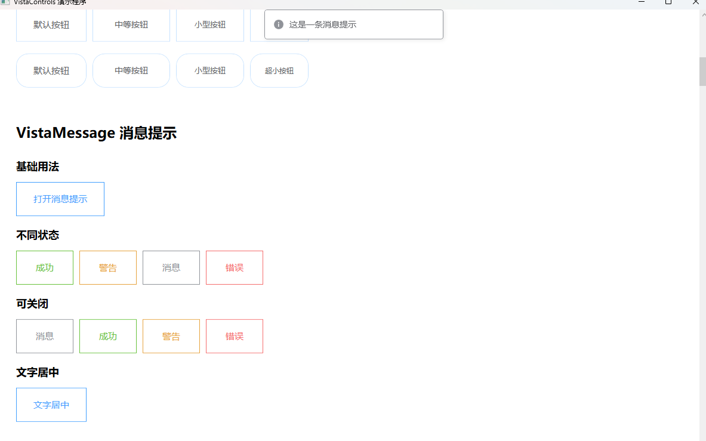
</p>

- **状态**: ✅ 已完成
- **描述**: 消息提示控件，常用于主动操作后的反馈提示
- **功能特性**:
  - 支持 4 种消息类型：Success、Warning、Info、Error
  - 支持自动关闭（可配置时长）
  - 支持手动关闭（显示关闭按钮）
  - 支持文字居中
  - 支持淡入淡出动画效果
- **详细说明**: 参见 [使用文档](VistaControls/USAGE.md)

---

### 3️⃣ VistaRadio - 单选框

<p align="center">
  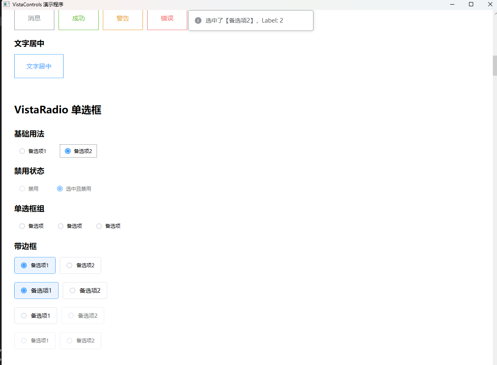
</p>

- **状态**: ✅ 已完成
- **描述**: 单选框控件，用于在一组备选项中进行单选
- **功能特性**:
  - 支持基础单选框和单选框组（RadioGroup）
  - 支持禁用状态
  - 支持带边框样式
  - 支持 4 种尺寸：Default、Medium、Small、Mini
  - 支持数据绑定和事件处理
- **详细说明**: 参见 [使用文档](VistaControls/USAGE.md)

---

### 4️⃣ VistaCheckbox - 多选框

<p align="center">
  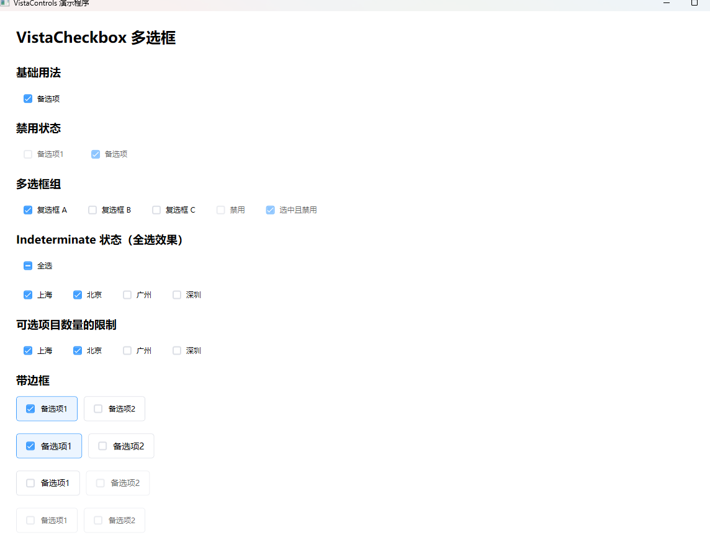
</p>

- **状态**: ✅ 已完成
- **描述**: 多选框控件，支持基础、多选组、禁用、带边框和尺寸
- **功能特性**:
  - 单个复选框与布尔值绑定
  - 复选框组（CheckboxGroup）与数组绑定
  - 支持禁用、带边框样式与多尺寸
  - 支持 `Min`/`Max` 限制可勾选数量
  - 支持 `indeterminate`（样式控制）与"全选"示例
- **详细说明**: 参见 [使用文档](VistaControls/USAGE.md)

---

### 5️⃣ VistaInput - 输入框

<p align="center">
  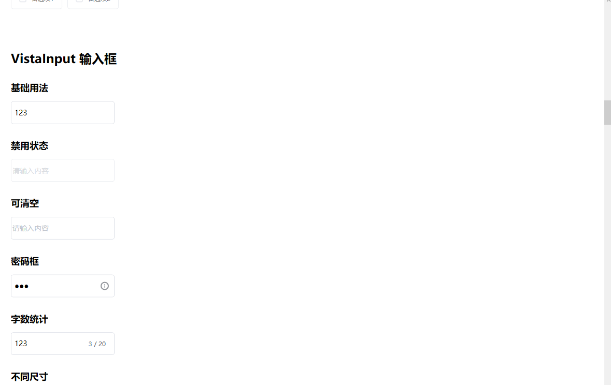
</p>

- **状态**: ✅ 已完成
- **描述**: 输入框控件，支持占位符、可清空、密码显示切换、字数统计与尺寸
- **功能特性**:
  - 占位符显示（文本为空时）
  - 可清空按钮（`Clearable`）
  - 密码模式（默认显示为点，支持切换明文查看）
  - 字数统计（`ShowWordLimit`）和多尺寸
- **详细说明**: 参见 [使用文档](VistaControls/USAGE.md)

---

### 6️⃣ VistaInputNumber - 数字输入框

<p align="center">
  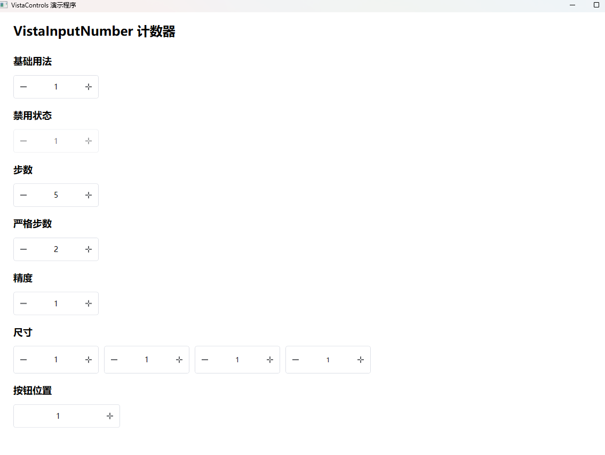
</p>

- **状态**: ✅ 已完成
- **描述**: 数字计数器输入框，支持范围、步长、精度、严格步长、尺寸和按钮布局
- **功能特性**:
  - `Min/Max` 范围限制与键盘上下键步进
  - `Step` 步长与 `StepStrictly` 严格步长（仅允许步长倍数）
  - `Precision` 精度（自动不小于步长小数位，四舍五入且不补零）
  - `Controls` 控制按钮与 `ControlsPosition="right"` 右侧按钮布局
  - 文本水平居中显示
- **详细说明**: 参见 [使用文档](VistaControls/USAGE.md)

---

### 7️⃣ VistaSelect - 下拉选择器

<p align="center">
  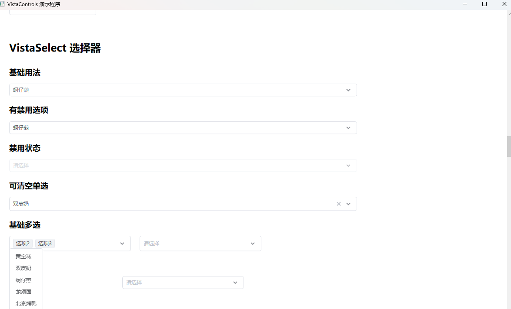
</p>

- **状态**: ✅ 已完成
- **描述**: 下拉选择器，支持单选、多选、清空、禁用选项、分组与折叠标签
- **功能特性**:
  - 单选（`SelectedValue`）与多选（`SelectedValues`）
  - `Clearable` 清空、`IsSelectDisabled` 禁用、`IsOptionDisabled` 选项禁用
  - `Multiple` 多选、`CollapseTags` 折叠显示已选项
  - `OptionGroup` 分组显示
- **详细说明**: 参见 [使用文档](VistaControls/USAGE.md)

---

### 8️⃣ VistaCascader - 级联选择器

<p align="center">
  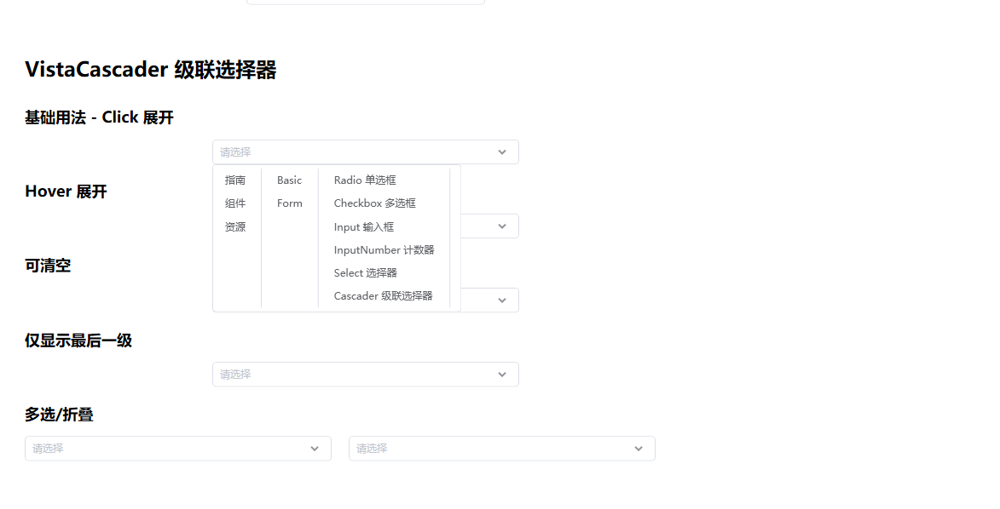
</p>

- **状态**: ✅ 已完成
- **描述**: 级联选择器，支持 click/hover 展开、单选/多选、清空与仅显示末级
- **功能特性**:
  - `Options` 多级树状数据
  - `ExpandTrigger`: Click 或 Hover
  - `Multiple` 多选、`CollapseTags` 折叠显示
  - `Clearable` 清空、`ShowAllLevels` 控制显示路径或仅末级
- **详细说明**: 参见 [使用文档](VistaControls/USAGE.md)

---

### 9️⃣ VistaSwitch - 开关

<p align="center">
  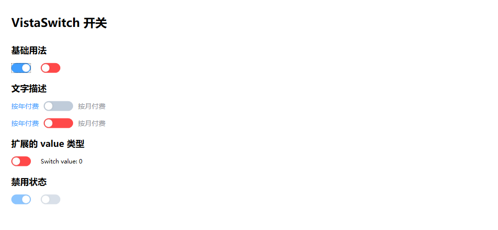
</p>

- **状态**: ✅ 已完成
- **描述**: 开关控件，表示两种相互对立的状态间的切换
- **功能特性**:
  - 支持 `Value` 绑定（boolean / string / number）
  - `ActiveValue`/`InactiveValue` 自定义值
  - `ActiveColor`/`InactiveColor` 自定义颜色
  - `ActiveText`/`InactiveText` 文字描述（显示在开关左右两侧）
  - 文字颜色根据开关状态切换（开启蓝色，关闭灰色）
  - 支持禁用状态
- **详细说明**: 参见 [使用文档](VistaControls/USAGE.md)

---

### 🔟 VistaSlider - 滑块

<p align="center">
  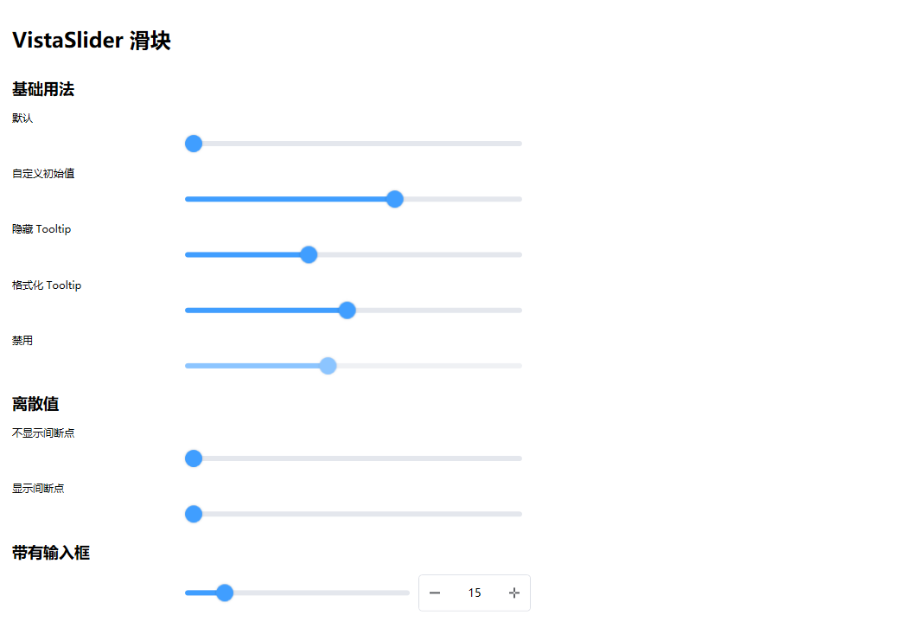
</p>

- **状态**: ✅ 已完成
- **描述**: 滑块控件，通过拖动滑块在一个固定区间内进行选择
- **功能特性**:
  - 进度条效果（灰色背景，蓝色进度）
  - `ShowTooltip` 显示/隐藏提示框，`FormatTooltip` 自定义格式化
  - `ShowStops` 显示间断点（白色圆点）
  - `ShowInput` 显示输入框，`ShowInputControls` 控制按钮显示
  - `TickFrequency` 步长控制
  - 支持禁用状态
- **详细说明**: 参见 [使用文档](VistaControls/USAGE.md)

---

### 1️⃣1️⃣ VistaTime - 时间选择器

<p align="center">
  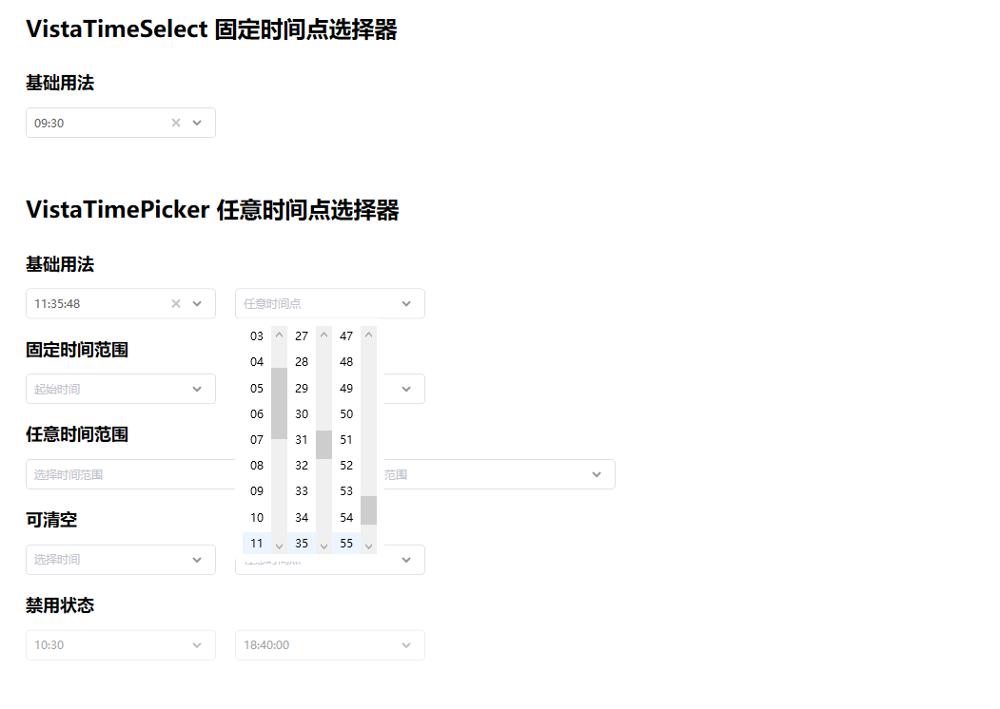
</p>

- **状态**: ✅ 已完成
- **描述**: 时间选择器，用于选择或输入时间
- **功能特性**:
  - `VistaTimeSelect` 固定时间点选择器（通过 start、end、step 指定可选时间）
  - `VistaTimePicker` 任意时间点选择器（可选择任意时间，支持 selectableRange）
  - 支持时间范围选择（`IsRange`）
  - 支持 `ArrowControl` 箭头控制模式
  - 支持 `Clearable` 清空、`Readonly` 只读、`IsDisabled` 禁用
  - 支持多种尺寸（Default、Medium、Small、Mini）
  - 支持 `MinTime`/`MaxTime` 限制可选时间范围
- **详细说明**: 参见 [使用文档](VistaControls/USAGE.md)

---

### 1️⃣2️⃣ VistaDatePicker - 日期选择器

<p align="center">
  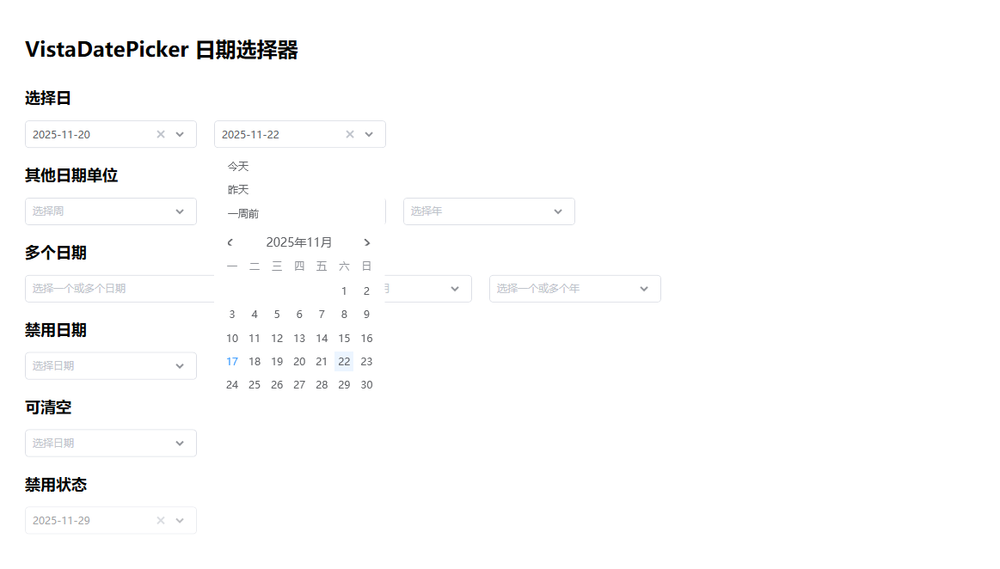
</p>

- **状态**: ✅ 已完成
- **描述**: 日期选择器，用于选择或输入日期
- **功能特性**:
  - 基本日期选择（按"日"）
  - 快捷选项（Today/Yesterday/一周前等，自定义回调）
  - 禁用日期（传入函数）
  - 其他日期单位：周、月、年、多个日期、多个月、多个年
  - 简洁美观的弹出面板，支持清空、只读、禁用
- **详细说明**: 参见 [使用文档](VistaControls/USAGE.md)

---

### 1️⃣3️⃣ VistaTable - 表格

<p align="center">
  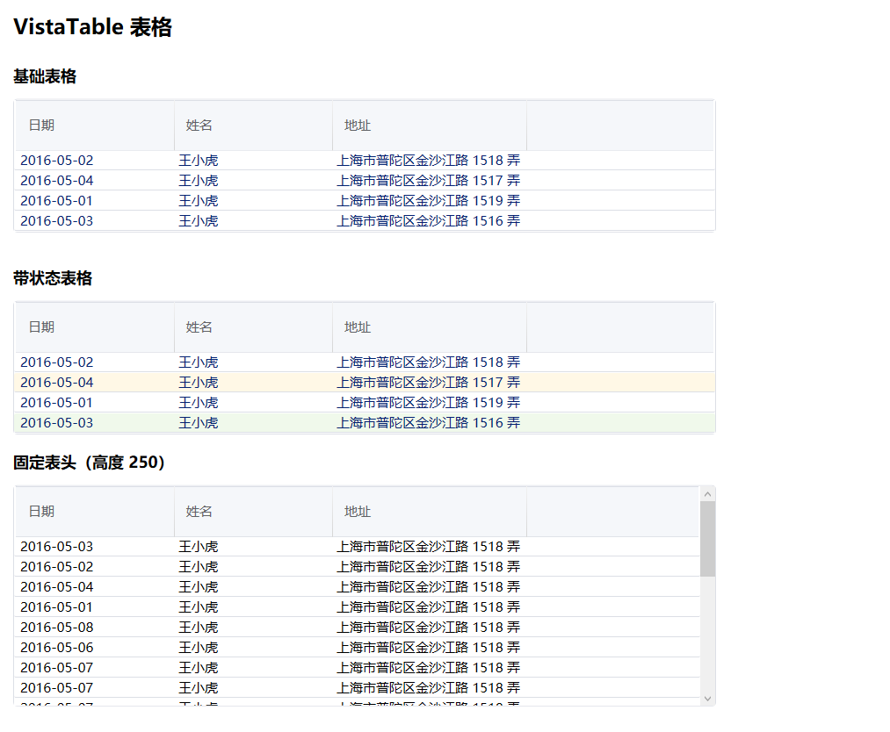
</p>

- **状态**: ✅ 已完成  
- **描述**: 表格控件，用于展示结构化数据
- **功能特性**: 支持列定义、数据绑定、固定表头、边框样式、自定义行高、字体大小、行样式选择器
- **详细说明**: 参见 [使用文档](VistaControls/USAGE.md)

---

### 1️⃣4️⃣ VistaTag - 标签

<p align="center">
  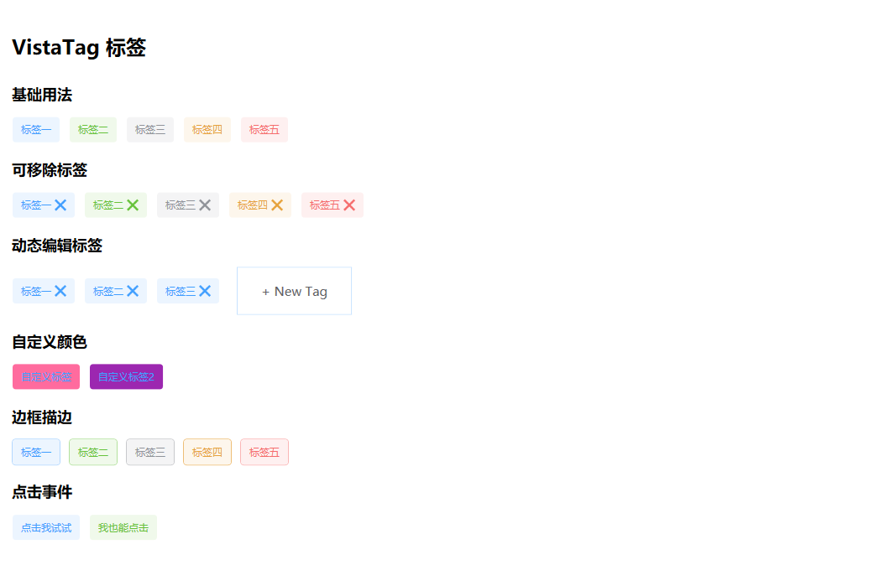
</p>

- **状态**: ✅ 已完成
- **描述**: 标签控件，用于标记和选择
- **功能特性**: 支持多种类型（Success、Info、Warning、Danger）、可移除、自定义颜色、边框描边、点击和关闭事件
- **详细说明**: 参见 [使用文档](VistaControls/USAGE.md)

---

### 1️⃣5️⃣ VistaProgress - 进度条

<p align="center">
  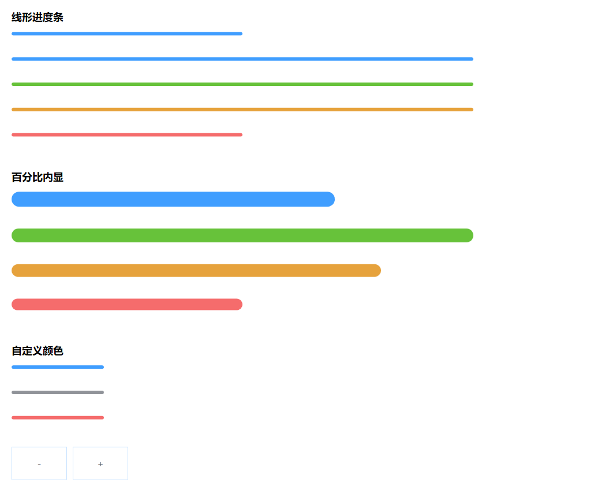
</p>

- **状态**: ✅ 已完成
- **描述**: 进度条控件，用于展示操作进度
- **功能特性**: 支持线形/环形/仪表盘形三种类型、百分比内显、自定义颜色、状态显示、自定义格式化文本
- **详细说明**: 参见 [使用文档](VistaControls/USAGE.md)

---

### 1️⃣6️⃣ VistaPagination - 分页

<p align="center">
  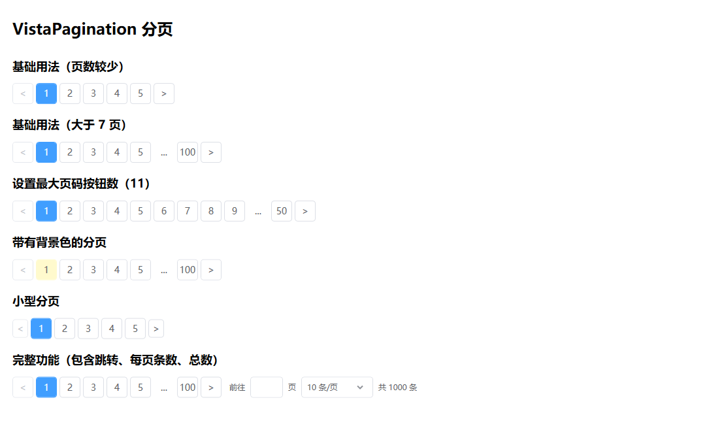
</p>

- **状态**: ✅ 已完成
- **描述**: 分页控件，用于分页显示数据
- **功能特性**: 支持基础分页、大页数分页、自定义每页条数、背景色、小尺寸样式、完整布局、多种事件
- **详细说明**: 参见 [使用文档](VistaControls/USAGE.md)

---

### 1️⃣7️⃣ VistaBadge - 标记

<p align="center">
  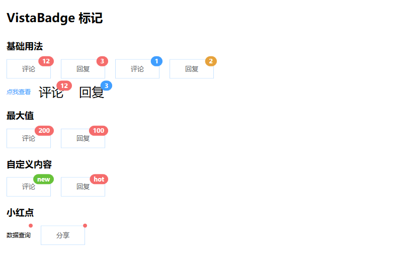
</p>

- **状态**: ✅ 已完成
- **描述**: 标记控件，出现在按钮、图标旁的数字或状态标记
- **功能特性**: 支持数字和字符串显示、最大值限制、自定义内容、小红点样式、多种类型
- **详细说明**: 参见 [使用文档](VistaControls/USAGE.md)

---

### 1️⃣8️⃣ VistaLoading - 加载

<p align="center">
  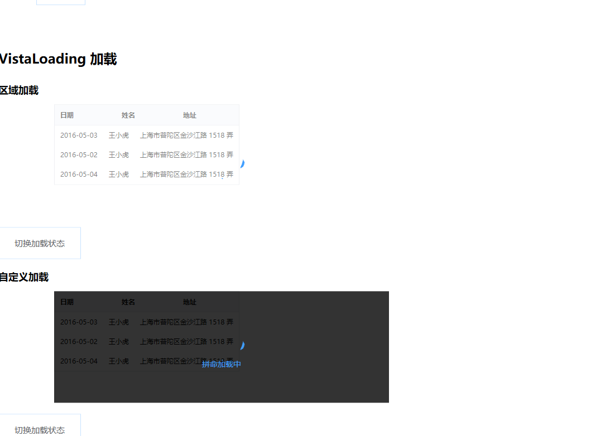
</p>

- **状态**: ✅ 已完成
- **描述**: 加载控件，加载数据时显示动效
- **功能特性**: 支持区域加载、自定义加载文本和背景色、服务方式调用、锁定交互
- **详细说明**: 参见 [使用文档](VistaControls/USAGE.md)

---

### 1️⃣9️⃣ VistaMessageBox - 弹框

<p align="center">
  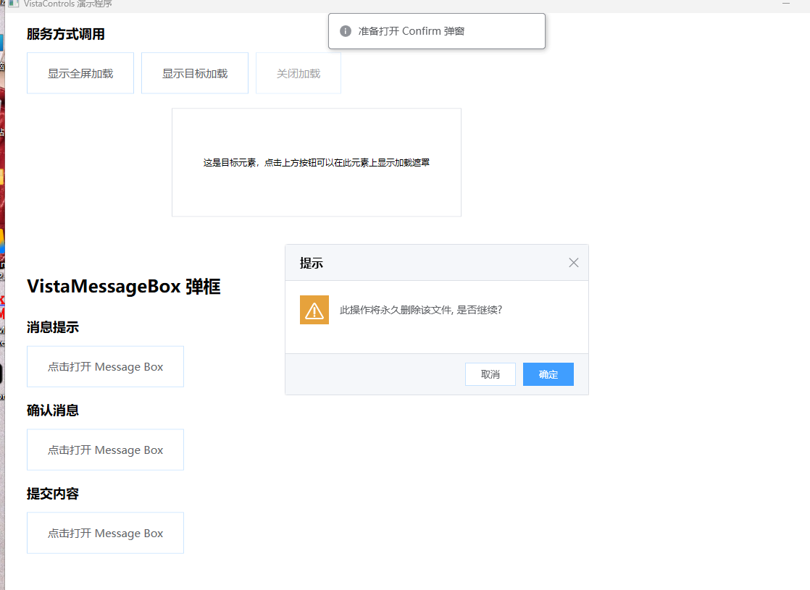
</p>

- **状态**: ✅ 已完成
- **描述**: 弹框控件，模拟系统的消息提示框
- **功能特性**: 支持Alert/Confirm/Prompt、多种类型图标、输入验证、异步和回调两种方式
- **详细说明**: 参见 [使用文档](VistaControls/USAGE.md)

---

### 2️⃣0️⃣ VistaTabs - 标签页

<p align="center">
  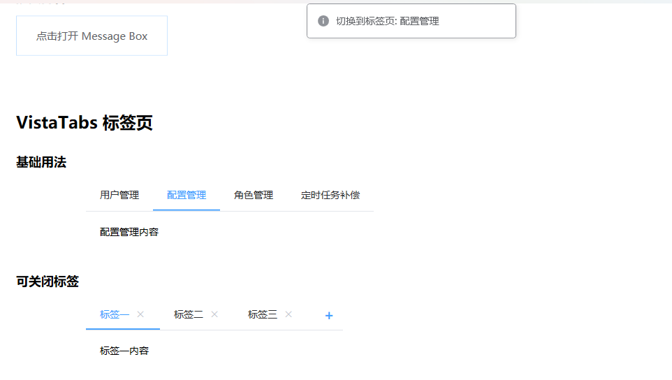
</p>

- **状态**: ✅ 已完成
- **描述**: 标签页控件，用于切换同级内容
- **功能特性**: 支持可关闭、添加按钮、布局切换（top/right/bottom/left）、BeforeLeave钩子、多种事件
- **详细说明**: 参见 [使用文档](VistaControls/USAGE.md)

---

### 2️⃣1️⃣ VistaDialog - 对话框

<p align="center">
  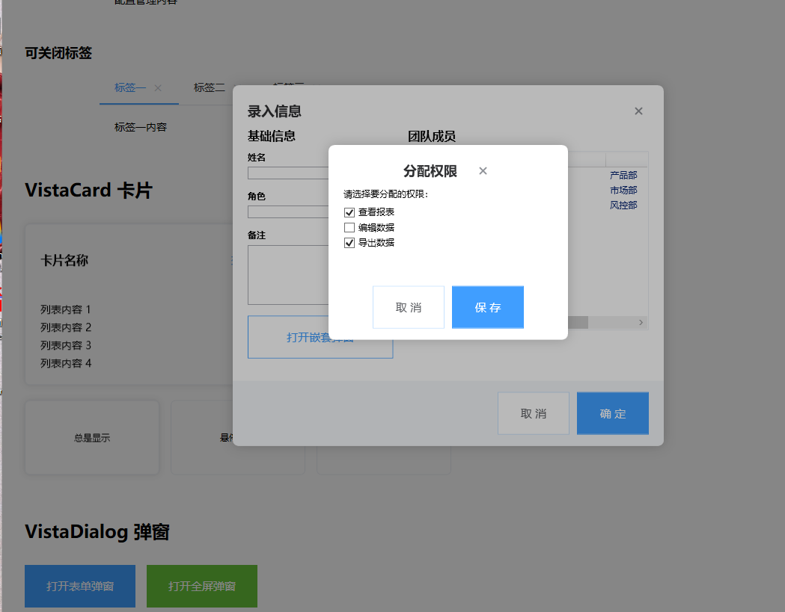
</p>

- **状态**: ✅ 已完成
- **描述**: 模态弹窗，支持嵌套、全屏、遮罩
- **功能特性**: 支持自定义布局、遮罩、多层弹窗、ESC/点击遮罩关闭、锁定滚动、插槽、多种事件
- **详细说明**: 参见 [使用文档](VistaControls/USAGE.md)

---

### 2️⃣2️⃣ VistaCard - 卡片

<p align="center">
  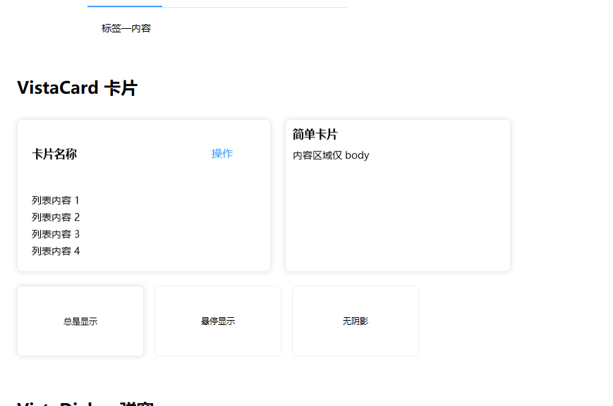
</p>

- **状态**: ✅ 已完成
- **描述**: 信息卡片容器，用于聚合展示内容
- **功能特性**: Header/Body布局、自定义内容区域、阴影控制（always/hover/never）、支持嵌套任意内容
- **详细说明**: 参见 [使用文档](VistaControls/USAGE.md)

---

## 开发计划

- [ ] 完善现有控件功能
- [ ] 添加更多实用控件
- [ ] 完善样式和主题系统
- [ ] 编写单元测试
- [ ] 发布 NuGet 包

## 贡献指南

欢迎提交 Issue 和 Pull Request 来帮助改进这个项目。

## 许可证

本项目采用 MIT 协议开源。详见 [LICENSE](LICENSE)。

简述：
- 允许使用、复制、修改、合并、发布、分发、再许可及/或销售本软件的副本
- 需在软件及重要部分中保留版权与许可声明
- 本软件按“现状”提供，不提供任何明示或暗示的担保

## 更新日志

### 2024-12 - VistaButton 控件
- ✅ 实现 VistaButton 控件，支持 Element UI 风格的所有功能
- ✅ 实现 ButtonGroup 控件
- ✅ 添加图标支持
- ✅ 完善样式系统
- ✅ 创建完整的演示程序

### 2024-12 - VistaRadio 控件
- ✅ 实现 VistaRadio 控件，支持 Element UI 风格的所有功能
- ✅ 实现 RadioGroup 控件，用于管理单选框组
- ✅ 支持禁用状态、带边框样式、多种尺寸
- ✅ 支持数据绑定和事件处理
- ✅ 创建完整的演示程序

### 2024-12 - VistaMessage 控件
- ✅ 实现 VistaMessage 控件，支持 Element UI 风格的所有功能
- ✅ 实现 MessageManager 服务类，用于管理消息显示
- ✅ 支持自动关闭、手动关闭、文字居中等功能
- ✅ 添加淡入淡出动画效果
- ✅ 创建完整的演示程序

### 2025-01 - VistaCheckbox / CheckboxGroup / VistaInput
- ✅ 实现 VistaCheckbox 控件及 CheckboxGroup 组容器
- ✅ 支持单项、多选组、禁用、带边框、尺寸、`Min/Max` 限制与 `indeterminate` 样式
- ✅ 实现 VistaInput 控件，支持占位符、可清空、密码显示切换、字数统计、尺寸
- ✅ 在 Demo 中添加完整示例

### 2025-01 - VistaInputNumber / VistaSelect / VistaCascader
- ✅ 实现 VistaInputNumber（数值计数器），支持范围、步长、精度、严格步长、尺寸、按钮位置
- ✅ 实现 VistaSelect/Option/OptionGroup，支持单/多选、清空、禁用、分组、折叠标签
- ✅ 实现 VistaCascader（级联选择器），支持 Click/Hover 展开、单/多选、清空、仅显示末级
- ✅ 在 Demo 中添加完整用例

### 2025-01 - VistaSwitch / VistaSlider
- ✅ 实现 VistaSwitch（开关控件），支持自定义值/颜色/文字、禁用状态
- ✅ 实现 VistaSlider（滑块控件），支持进度条效果、Tooltip、间断点、输入框
- ✅ 在 Demo 中添加完整示例

### 2025-01 - VistaTimeSelect / VistaTimePicker
- ✅ 实现 VistaTimeSelect（固定时间点选择器），支持 start/end/step 配置
- ✅ 实现 VistaTimePicker（任意时间点选择器），支持 selectableRange、范围选择
- ✅ 支持时间范围选择、箭头控制模式、清空、只读、禁用等属性
- ✅ 在 Demo 中添加完整示例

### 2025-11 - VistaDatePicker
- ✅ 实现 VistaDatePicker（日期选择器）：日、周、月、年、多个日期/月份/年份
- ✅ 支持快捷选项与禁用日期，清空、只读、禁用
- ✅ 修复 OnValueChanged 触发与 Popup 交互问题，优化交互体验
- ✅ 在 Demo 中添加完整用例

### 2025-01 - VistaTable / VistaTag / VistaProgress / VistaPagination
- ✅ 实现 VistaTable（表格控件），支持列定义、数据绑定、固定表头、边框样式、自定义行高
- ✅ 实现 VistaTag（标签控件），支持多种类型、可移除、自定义颜色、边框描边、事件处理
- ✅ 实现 VistaProgress（进度条控件），支持线形/环形/仪表盘形、百分比内显、自定义颜色、状态显示
- ✅ 实现 VistaPagination（分页控件），支持基础分页、大页数、自定义每页条数、完整布局、多种事件
- ✅ 在 Demo 中添加完整示例

### 2025-01 - VistaBadge / VistaLoading / VistaMessageBox
- ✅ 实现 VistaBadge（标记控件），支持数字/字符串显示、最大值限制、自定义内容、小红点样式
- ✅ 实现 VistaLoading（加载控件），支持区域加载、服务方式调用、自定义文本和背景色
- ✅ 实现 VistaMessageBox（弹框控件），支持 Alert/Confirm/Prompt、多种类型图标、输入验证
- ✅ 在 Demo 中添加完整示例

### 2025-01 - VistaTabs / VistaDialog
- ✅ 实现 VistaTabs（标签页控件），支持可关闭、添加按钮、布局切换、before-leave 钩子
- ✅ 实现 VistaDialog（模态弹窗），支持遮罩、嵌套、全屏、BeforeClose 回调
- ✅ Demo 中示范可关闭分页、嵌套弹窗、表单与全屏场景

### 2025-01 - VistaCard
- ✅ 实现 VistaCard（卡片样式），支持 Header/Body Slot、BodyPadding、阴影配置
- ✅ Demo 中展示基础卡片、简易卡片及不同阴影模式

### 计划中
- ⏳ DateTimePicker（日期时间选择器）：暂不实现，后续版本加入


### 2024 - 项目初始化
- 创建项目基础结构
- 添加示例控件 CustomControl1
- 创建项目文档和使用文档

---

**注意**: 本项目正在积极开发中，API 可能会发生变化。建议在生产环境使用前进行充分测试。

